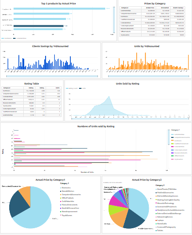
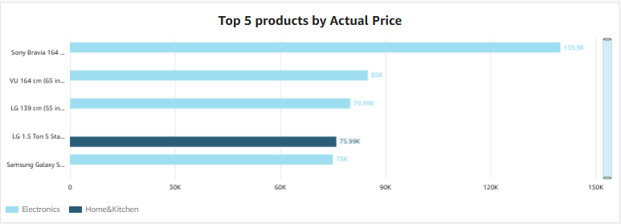
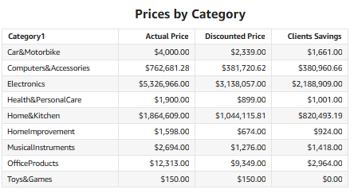
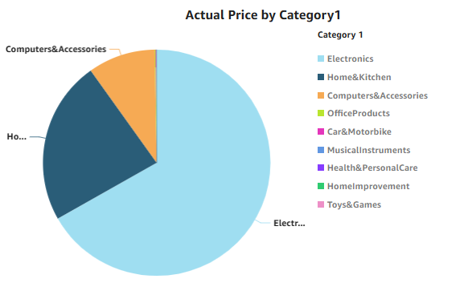
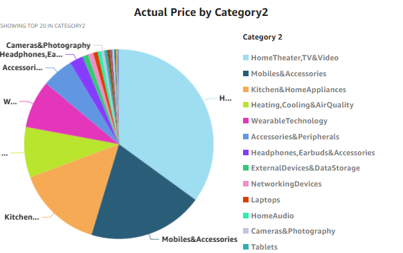
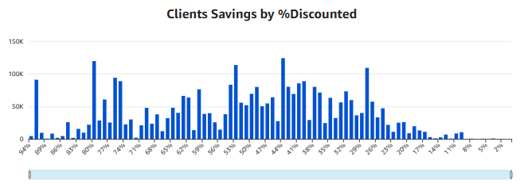
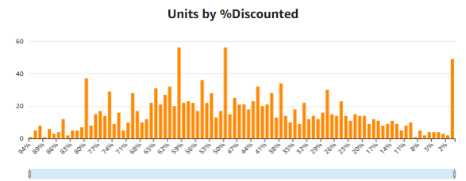
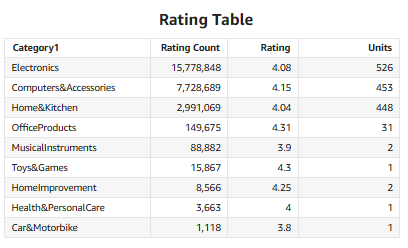
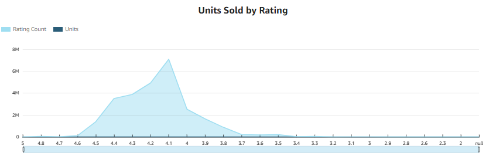
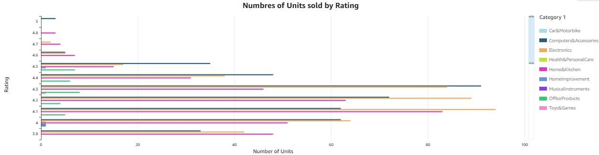

# Amazon Sales Dashboard
This dashboard was built using Amazon QuickSight to analyze product performance, discounts, ratings, and category trends.

## Full Dashboard

## Dashboard Objective
- The goal of this dashboard is to analyze product performance and consumer behavior, identifying the units with discount, categories, rating and typical products characteristics.

## Dataset
The dataset contains information about the products and prices. 

Key features include:

- *product_id* – Unique product ID  
- *product_name* – Product Name  
- *category* – Category of the product  
- *discounted_price* – Final price with discount  
- *actual_price* – Actual price
- *discount_percentage* – Percentage of the discount from the actual price
- *rating* – Client rate of the product   
- *rating_count* – Number of rates from the clients for a certain product
- *about_product* – Description of the product  
- *user_id* – Unique number ID from client
- *user_name* – Username of the client  
- *review_id* – Unique review ID
- *review_title* –  Title of the client review
- *review_content* – Comments of the client review
- *img_link* - URL of the image product
- *product_link* - URL of the product

## Tech Stack
- Python 
- Amazon S3 - Storage 
- AWS Glue – Data cleaning and preprocessing    
- Athena - Queries results
- Amazon QuickSight - Data visualization dashboard

## Feature Engineering
- *units* - Number of units

## Visualizations
The dashboard includes the following visualizations:

- Top products with the highest actual price.
- Table showing Prices by category
- Bar chart showing clients savings based on the discount price
- Bar chart showing units sold depending on the discount percentage
- Table with Rating and number of units by category
- Chart showing the relationship between units sold and rating
- Bar chart with the number of units sold by rating
- Pie chart by category 1 based on the actual price of the units
- Pie chart by category 2 based on the actual price of the units

## Filters
- The dashboard includes an interactive Category Level 1 filter, allowing users to explore product performance by category.
- Most visualizations dynamically update based on the selected category, enabling deeper analysis of product behavior and consumer trends.

## Key Insights
- Four of the most expensive products belong to the Electronics category. 
- One product had a 91% discount, representing a potential revenue reduction of $91,000. 
- Customers purchase the highest number of units when discounts are between 50% and 60%.
- Products with ratings between 4.0 and 4.4 are more likely to be purchased.
- The categories with the most rating count, were the ones who sold more.

## Dashboard Content

### Top 5 Products

### Category

### Clients Savings and Units with Discount

#### Rating

